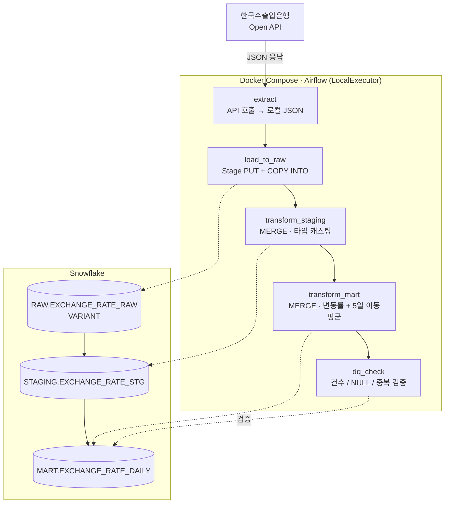

# ExchangeFlow

매일 환율 데이터를 자동 수집·적재·변환하는 ELT 파이프라인

Docker(Airflow) → Snowflake RAW(VARIANT) → STAGING(캐스팅) → MART(변동률·이동평균)

## 아키텍처



스케줄: 평일 11:30 KST (`30 11 * * 1-5`, Asia/Seoul) — 한국수출입은행 API는
영업일 오전 11시 전후 당일 고시환율을 갱신하며, 휴장일에는 빈 응답을 반환한다.
이 경우 `extract` 태스크가 실패가 아닌 skip으로 처리된다 (실행 로그로 확인됨).

MERGE 기반 upsert(`(result_date, cur_unit)` 키)로 STAGING/MART를 적재하므로
동일 날짜를 재실행하거나 backfill해도 중복 없이 안전하다.

## 사전 준비

1. **한국수출입은행 Open API 키** 발급: https://www.koreaexim.go.kr/ir/HPHKIR019M01
2. **Snowflake 계정** (무료 체험 가능) — 아래 SQL로 초기 스키마 생성

```sql
-- Snowflake Worksheet에서 실행
!source sql/create_tables.sql
```

## 로컬 실행

```bash
cp .env.example .env
# .env에 EXIM_API_KEY, SNOWFLAKE_* 값 채우기

docker compose up -d
```

Airflow 웹 UI: http://localhost:8080 (기본 계정 admin/admin, `.env`에서 변경 가능)

### Snowflake Connection 등록 (Airflow UI)

Admin → Connections → `+` 로 아래 값 등록:

| 필드 | 값 |
|---|---|
| Connection Id | `snowflake_default` |
| Connection Type | Snowflake |
| Schema | `RAW` |
| Login | `SNOWFLAKE_USER` |
| Password | `SNOWFLAKE_PASSWORD` |
| Account | `SNOWFLAKE_ACCOUNT` |
| Extra | `{"warehouse": "EXCHANGEFLOW_WH", "database": "EXCHANGEFLOW", "role": "<role>"}` |

등록 후 DAG `exchange_rate_pipeline`을 Unpause하고 Trigger로 수동 실행해 확인한다.

### 실행 확인

`extract → load_to_raw → transform_staging → transform_mart → dq_check` 전 구간을
로컬 Docker Compose 환경에서 end-to-end로 실행해 검증했다.

```
[dq_check] DQ 통과 [2026-08-14] rows=23
```

휴장일(주말)에 스케줄 실행되면 `extract`가 API 빈 응답을 감지해 실패 없이 skip
처리되는 것도 함께 확인했다.

### 스크립트 단독 테스트 (Airflow 없이)

```bash
pip install -r requirements.txt

python scripts/extract.py --date 20260814
python scripts/load_to_snowflake.py --file data/exchange_rate_20260814.json
```

## 폴더 구조

```
exchangeflow/
├── dags/
│   └── exchange_rate_pipeline.py
├── scripts/
│   ├── extract.py
│   └── load_to_snowflake.py
├── sql/
│   ├── create_tables.sql
│   ├── staging_transform.sql
│   └── mart_transform.sql
├── docs/
│   └── PLAN.md          # 개발 계획서 (설계 의도, 단계별 일정)
├── docker-compose.yml
├── requirements.txt
├── .env.example
└── README.md
```

## 기술 스택

Docker Compose · Apache Airflow(LocalExecutor) · Snowflake · Python

## 운영 배포

로컬 개발/검증을 우선 진행 중이며, 운영 배포(상시 호스팅)는 이후 단계에서 진행 예정.
