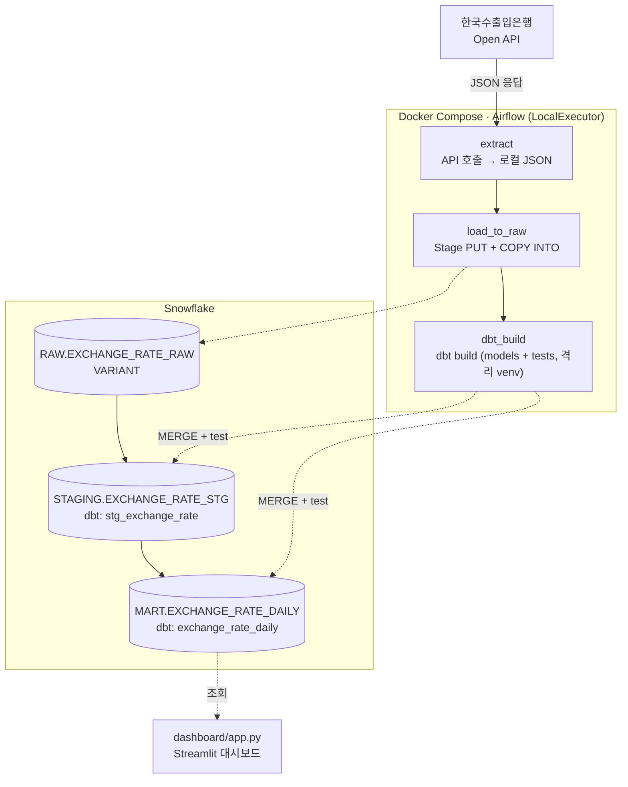

# ExchangeFlow

매일 환율 데이터를 자동 수집·적재·변환하고 대시보드로 시각화하는 ELT 파이프라인

Docker(Airflow) → Snowflake RAW(VARIANT) → dbt(STAGING 캐스팅 → MART 변동률·이동평균) → Streamlit 대시보드

## 목차

- [아키텍처](#아키텍처)
- [사전 준비](#사전-준비)
- [로컬 실행](#로컬-실행)
- [dbt](#dbt)
- [대시보드](#대시보드)
- [폴더 구조](#폴더-구조)
- [기술 스택](#기술-스택)
- [운영 배포](#운영-배포)

## 아키텍처



스케줄: 평일 11:30 KST (`30 11 * * 1-5`, Asia/Seoul) — 한국수출입은행 API는
영업일 오전 11시 전후 당일 고시환율을 갱신하며, 휴장일에는 빈 응답을 반환한다.
이 경우 `extract` 태스크가 실패가 아닌 skip으로 처리된다 (실행 로그로 확인됨).

STAGING/MART는 dbt incremental 모델(merge 전략, `(result_date, cur_unit)` 키)로
적재하므로 동일 날짜를 재실행하거나 backfill해도 중복 없이 안전하다.

## 사전 준비

1. **한국수출입은행 Open API 키** 발급: https://www.koreaexim.go.kr/ir/HPHKIR019M01
2. **Snowflake 계정** (무료 체험 가능) — 아래 SQL로 초기 스키마 생성

```sql
-- Snowflake Worksheet에서 실행
!source sql/create_tables.sql
```

## 로컬 실행

```bash
cp .env.example .env
# .env에 EXIM_API_KEY, SNOWFLAKE_* 값 채우기

docker compose up -d
```

Airflow 웹 UI: http://localhost:8080 (기본 계정 admin/admin, `.env`에서 변경 가능)

### Snowflake Connection 등록 (Airflow UI)

Admin → Connections → `+` 로 아래 값 등록:

| 필드 | 값 |
|---|---|
| Connection Id | `snowflake_default` |
| Connection Type | Snowflake |
| Schema | `RAW` |
| Login | `SNOWFLAKE_USER` |
| Password | `SNOWFLAKE_PASSWORD` |
| Account | `SNOWFLAKE_ACCOUNT` |
| Extra | `{"warehouse": "EXCHANGEFLOW_WH", "database": "EXCHANGEFLOW", "role": "<role>"}` |

등록 후 DAG `exchange_rate_pipeline`을 Unpause하고 Trigger로 수동 실행해 확인한다.

### 실행 확인

`extract → load_to_raw → dbt_build`(dbt build: STAGING/MART 모델 + 데이터 품질
테스트) 전 구간을 로컬 Docker Compose 환경에서 end-to-end로 실행해 검증했다.

```
Done. PASS=11 WARN=0 ERROR=0 SKIP=0 NO-OP=0 REUSED=0 TOTAL=11
```

`airflow dags backfill`로 2026-08-10 ~ 2026-08-14(영업일 5일)을 채워 넣어
MART의 `ma_5`(5영업일 이동평균)가 실제 5일치 데이터로 계산되는 것도 확인했다
(예: USD 기준 2026-08-14 `ma_5=1416.06`).

휴장일(주말)에 스케줄 실행되면 `extract`가 API 빈 응답을 감지해 실패 없이 skip
처리되는 것도 함께 확인했다.

### 스크립트 단독 테스트 (Airflow 없이)

```bash
pip install -r requirements.txt

python scripts/extract.py --date 20260814
python scripts/load_to_snowflake.py --file data/exchange_rate_20260814.json
```

## dbt

STAGING/MART 변환은 `dbt/`에 있는 dbt 프로젝트가 담당한다 (구 `sql/staging_transform.sql`,
`sql/mart_transform.sql`을 대체).

- `models/staging/stg_exchange_rate.sql` — RAW → STAGING 타입 캐스팅 (incremental·merge)
- `models/mart/exchange_rate_daily.sql` — STAGING → MART 변동률·5영업일 이동평균 (incremental·merge)
- `not_null`/`unique_combination_of_columns`(dbt_utils) + `assert_mart_not_stale`(최신
  고시일 4일 이상 미갱신 시 실패) 테스트로 기존 `dq_check` 태스크를 대체

dbt-snowflake를 Airflow 파이썬 환경에 같이 설치하면 의존성 충돌 위험이 있어,
`Dockerfile`에서 `/opt/dbt_venv`라는 격리된 venv에 따로 설치하고 Airflow는
`BashOperator`로 그 venv의 `dbt` 바이너리만 호출한다.

로컬에서 직접 실행하려면:

```bash
python -m venv .dbtvenv && .dbtvenv/Scripts/pip install -r dbt/requirements.txt
# .env의 SNOWFLAKE_* 값을 셸 환경변수로 로드한 뒤
.dbtvenv/Scripts/dbt deps --project-dir dbt --profiles-dir dbt
.dbtvenv/Scripts/dbt build --project-dir dbt --profiles-dir dbt
```

## 대시보드

MART.EXCHANGE_RATE_DAILY를 조회하는 Streamlit 환율 모니터링 대시보드. 4개 탭으로 구성:

- **개요** — KPI 카드, 추이 차트(정규화/5일 MA 오버레이), 기간 등락률 랭킹, 기간 요약 통계
- **통화별 상세** — 교차환율 계산기, 이동평균 이격도·추세 신호, 일별 변동률 히트맵
- **변동성 · 리스크** — 급변 알림(임계치 슬라이더), 연율화 변동성, 통화 간 상관관계
- **데이터 & 파이프라인** — 운영 카드(적재 행수/누락 고시일), 적재 이력, 원본 데이터

```bash
pip install -r requirements.txt
streamlit run dashboard/app.py
```

`.env`의 `SNOWFLAKE_*` 값을 그대로 사용한다 (로컬 스크립트 단독 실행과 동일).
`.streamlit/config.toml`로 테마(accent `#ff4b4b`)를 지정했다.

한계: 누락 고시일은 공휴일 캘린더 없이 평일 기준으로만 계산한다.

## 폴더 구조

```
exchangeflow/
├── dags/
│   └── exchange_rate_pipeline.py
├── scripts/
│   ├── extract.py
│   └── load_to_snowflake.py
├── dbt/                   # STAGING/MART 변환 (dbt 프로젝트)
│   ├── models/
│   │   ├── staging/       # stg_exchange_rate + 소스/테스트 정의
│   │   └── mart/          # exchange_rate_daily + 테스트 정의
│   ├── tests/             # 싱글턴 테스트 (assert_mart_not_stale)
│   ├── macros/
│   ├── dbt_project.yml
│   └── profiles.yml       # SNOWFLAKE_* 환경변수 기반 (비밀값 없음)
├── dashboard/
│   └── app.py            # Streamlit 대시보드
├── .streamlit/
│   └── config.toml       # 대시보드 테마
├── sql/
│   └── create_tables.sql # RAW 스키마/스테이지만 생성 (STAGING/MART는 dbt가 관리)
├── docs/
│   └── PLAN.md          # 개발 계획서 (설계 의도, 단계별 일정)
├── Dockerfile             # Airflow 이미지 + dbt 격리 venv
├── docker-compose.yml
├── requirements.txt
├── .env.example
└── README.md
```

## 기술 스택

Docker Compose · Apache Airflow(LocalExecutor) · dbt · Snowflake · Python · Streamlit · Plotly · pandas

## 운영 배포

로컬 개발/검증을 우선 진행 중이며, 운영 배포(상시 호스팅)는 이후 단계에서 진행 예정.
